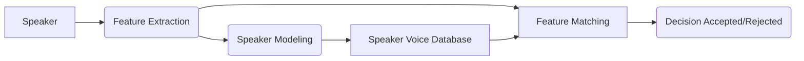

# RocketElevators-MachineLearning
Contains all the code for the week 13 for Machine Learning

### Week 13 overview

This week we had to create a Machine learning API using the Azure Api  **Speech**.
We used our voice to simulate conversation that happen inside an elevator.

#
### Exemple of how the  *Speech Api* actually work:

> **Pros:** The **Speech-To-Text** worked really well and the transcription doesnt differ a lot from the true result.

> **Cons:** The **Speech API** from  **Azure** as some flaws where it wont recognize enrolled voice from conversation.

### Languages used 

> Ruby *(For Website page)*

> JavaScript *(For the Machine Learning)*

## Team

 > Trevor Kitchen

 > Fabian Dimitrov 

 > Loic Rico

 > William Sinclair
​

 > Joey Coderre 
​
​
