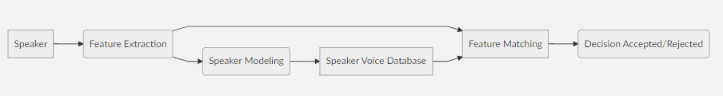
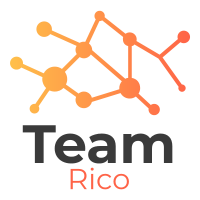

# Machine Learning
Contains all the code for the week 13 for Machine Learning

### Week 13 overview

This week we had to create a Machine learning API using the Azure Api **Speech**. We used our voice to simulate a conversation that happen inside an elevator and see how well it can detect our voice and if it was able to translate it to text. From the **Speech** Service offered by Azure we have used *Speech-to-Text* and *Speaker Recognition*.

### Exemple of how the  *Speech Api* actually work:

First we create a *.wav* sound in this specific specs :
|# Rate                         |Format         |Channel  |
|-------------------------------|---------------|---------|
|`16000Hz`                        |`16-bit`       |`1(Mono)`|

We then enroll the *.wav* sound and extract them for modeling and then send to the database. Once enrolled we can use an other sample and let the **API** compare the 2 sounds together and then give a results based on the modeling from the first data we gave. The 2 major result are `Accepted (score > 0.5)` and `Rejected (score < 0.5)`.

> **Pros:** The **Speech-To-Text** worked really well and the transcription doesnt differ a lot from the true result.
> 
> **Cons:** The **Speech API** from  **Azure** as some flaws where it wont recognize enrolled voice from conversation.

### Languages used 

- Ruby *(For Website page)*
- JavaScript *(For the Machine Learning)*

## Team

 > [Trevor Kitchen][4]
 >
 > [Fabian Dimitrov][1] 
 >
 > [Loic Rico][3]
 >
 > [William Sinclair][5]
 >
 > [Joey Coderre][2]

  [1]: https://github.com/ArtificialSoda
  [2]: https://github.com/Jcoderre
  [3]: https://github.com/ricoloic
  [4]: https://github.com/trevorius
  [5]: https://github.com/WilliamSinclairF

